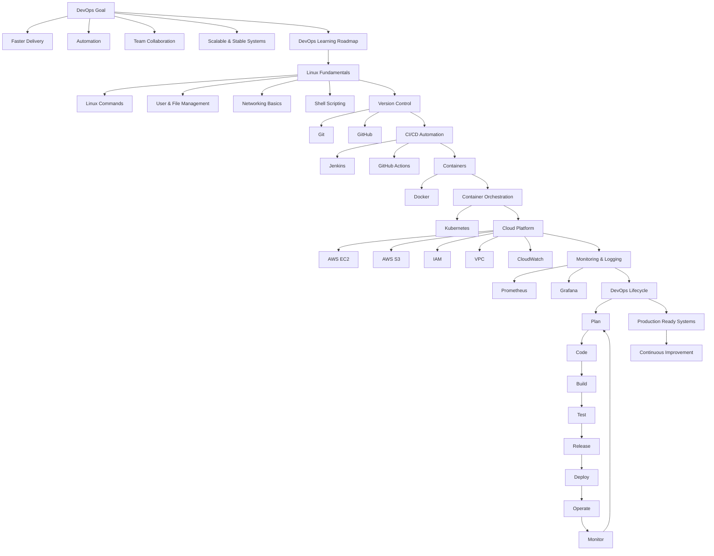
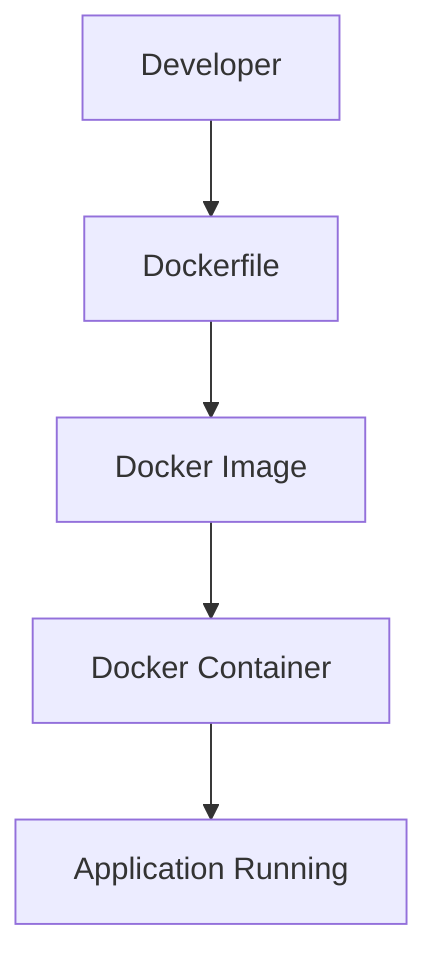
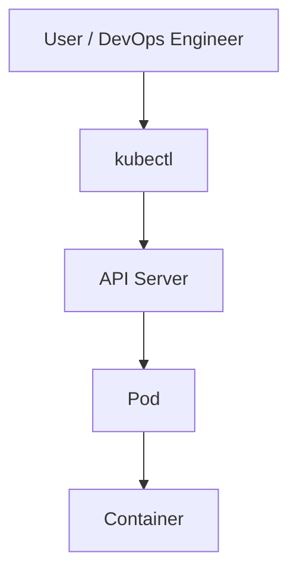
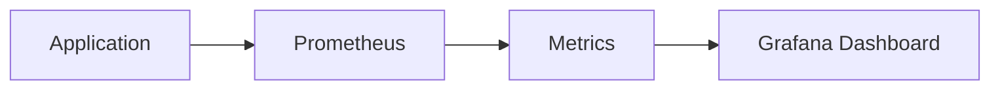
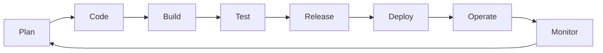
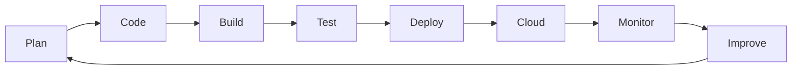

# 🚀 DevOps Mastery Roadmap  
### From Beginner to Production-Ready Engineer

> A **complete, practical, and structured DevOps roadmap** designed to help you learn DevOps the *right way* — step by step, with clarity and purpose.

---

## 🌟 Why This DevOps Roadmap?

Most beginners fail in DevOps because they:
- Learn tools randomly ❌  
- Skip fundamentals ❌  
- Don’t understand *why* a tool is used ❌  

This roadmap fixes that.

✅ Clear order  
✅ Strong fundamentals  
✅ Industry-relevant tools  
✅ Production mindset  

---

## 🎯 What is DevOps? (Simple Meaning)

**DevOps = Development + Operations**

DevOps is a culture and practice that helps teams:
- Deliver software **faster**
- Reduce failures
- Automate everything possible
- Improve collaboration
- Build **stable & scalable systems**

---

## 🧭 Complete DevOps Learning Flow (Visual Roadmap)

> ⚠️ Works best on **GitHub** (Mermaid supported)

## 🧱 Phase-Wise DevOps Learning Plan

This section breaks DevOps learning into **clear phases**, helping you move from **beginner → job-ready** in a structured way.

---

### 🐧 Phase 1: Linux Fundamentals (Foundation)

> Linux is the backbone of DevOps. Every server you work with will run on Linux.

**What to Learn**
- File & directory management
- Permissions & ownership
- User & group management
- Process & service management
- Networking basics
- Bash / Shell scripting

**Why This Phase Matters**
- Helps you work confidently on servers
- Builds automation thinking
- Essential for cloud and CI/CD tools

**Outcome**
✅ Comfortable working with Linux servers  
✅ Able to automate basic tasks  

---

### 🌿 Phase 2: Version Control (Git & GitHub)

> DevOps is teamwork — Git makes collaboration possible.

**What to Learn**
- Git basics (init, clone, commit, push, pull)
- Branching & merging
- Conflict resolution
- Pull Requests
- GitHub workflows

**Why This Phase Matters**
- Enables collaboration with teams
- Tracks and manages code changes
- Required for CI/CD pipelines

**Outcome**
✅ Confident in Git & GitHub  
✅ Able to work in team environments  

---

### 🔄 Phase 3: CI/CD Automation

> CI/CD is the heart of DevOps.

**What to Learn**
- CI/CD concepts
- Jenkins fundamentals
- Jenkins pipelines
- GitHub Actions workflows
- Automated build & test

**Why This Phase Matters**
- Eliminates manual deployments
- Improves software quality
- Speeds up delivery

**Outcome**
✅ Automated pipelines  
✅ Faster & reliable releases  

---

### 📦 Phase 4: Containers (Docker)

> Docker solves the “works on my machine” problem.

**What to Learn**
- Docker architecture
- Images & containers
- Dockerfile
- Docker Compose
- Container best practices

**Why This Phase Matters**
- Creates consistent environments
- Simplifies deployments
- Required for Kubernetes

**Outcome**
✅ Containerized applications  
✅ Portable & scalable builds  

---

### ☸️ Phase 5: Container Orchestration (Kubernetes)

> Kubernetes manages containers at scale.

**What to Learn**
- Pods, deployments, services
- Scaling & self-healing
- ConfigMaps & Secrets
- Basic Kubernetes networking

**Why This Phase Matters**
- Handles production workloads
- Ensures high availability
- Industry standard for orchestration

**Outcome**
✅ Scalable & resilient applications  
✅ Production-ready deployments  

---

### ☁️ Phase 6: Cloud Platform (AWS Core Services)

> Cloud is where DevOps systems run.

**What to Learn**
- EC2 (Compute)
- S3 (Storage)
- IAM (Security & access)
- VPC (Networking)
- CloudWatch (Monitoring)

**Why This Phase Matters**
- Hosts real-world applications
- Enables scalability & reliability
- Essential for DevOps jobs

**Outcome**
✅ Cloud infrastructure knowledge  
✅ Secure & scalable systems  

---

### 📊 Phase 7: Monitoring & Logging

> You can’t fix what you can’t see.

**What to Learn**
- Monitoring concepts
- Prometheus metrics
- Grafana dashboards
- Logs & alerting basics

**Why This Phase Matters**
- Detects failures early
- Improves system reliability
- Critical for production support

**Outcome**
✅ Observable systems  
✅ Faster issue resolution  

---

### 🔁 Phase 8: DevOps Lifecycle & Best Practices

> DevOps is a continuous process, not a one-time task.

**Lifecycle Stages**
- Plan
- Code
- Build
- Test
- Release
- Deploy
- Operate
- Monitor

**Why This Phase Matters**
- Connects all DevOps tools
- Builds real-world mindset
- Prepares you for interviews

**Final Outcome**
🚀 Job-ready DevOps Engineer  
🚀 Automation & cloud expertise  
🚀 Production-level confidence  

---

